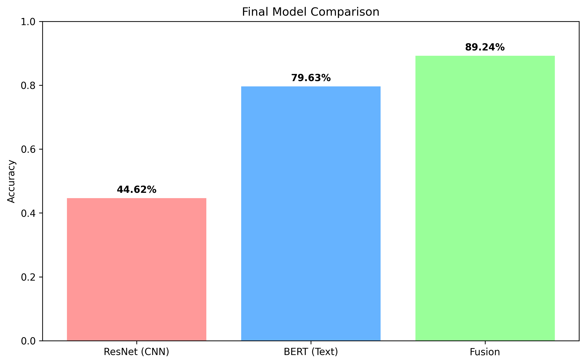
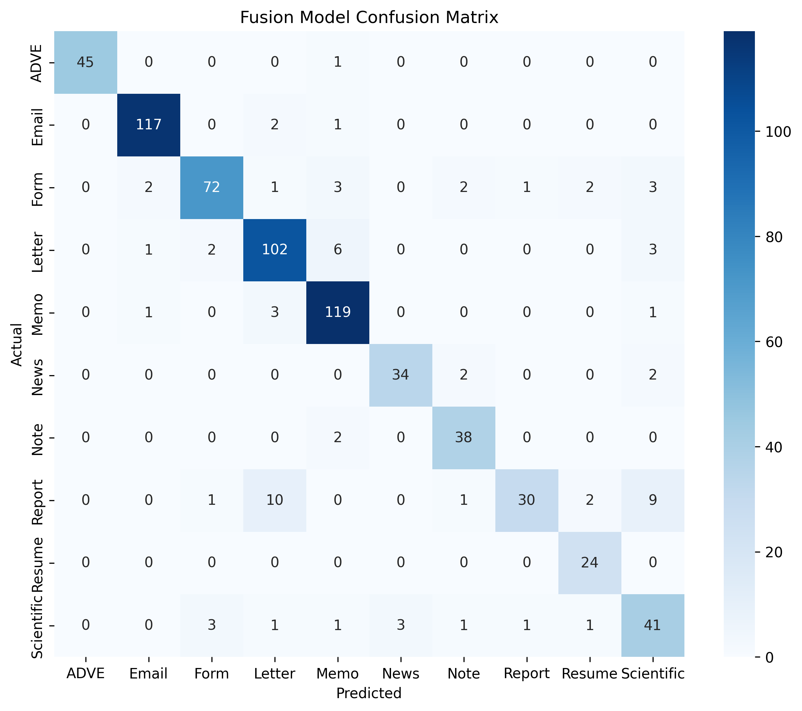

# Multimodal Document Classifier

A document classification system built with **PyTorch** that combines visual layout analysis and textual context into a single decision engine.

## Logic & Strategy
The system uses a fusion approach to identify documents that are often indistinguishable by sight alone:
1.  **Visual Branch (CNN):** A ResNet-based model that analyzes the geometry and structure of the page.
2.  **Linguistic Branch (NLP):** A BERT transformer that processes text extracted via **EasyOCR** to identify the semantic context of the document.

## System Architecture

### 1. Feature Fusion
* **Vision:** Uses a ResNet-18 pipeline to extract spatial features from the document layout.
* **Text:** Uses a fine-tuned **BERT** model to convert OCR-extracted text into contextual embeddings.
* **Bridge:** A neural network merges these two streams, allowing the model to make a final prediction based on both visual and textual evidence.

### 2. Implementation
* **End-to-End Fine-Tuning:** Both branches were unfrozen during training to synchronize their understanding of the dataset.
* **OCR Integration:** By using EasyOCR, the model interprets the actual information within the document rather than guessing based on pixels.

## Classification Categories
The model categorizes documents into 10 identities:
**ADVE, Email, Form, Letter, Memo, News, Note, Report, Resume, and Scientific.**

## Performance Results

The fusion of vision and language creates a synergy where the combined model is more accurate than either branch acting alone.

### Accuracy Benchmarks
| Stream | Test Accuracy |
| :--- | :--- |
| **Vision Only (ResNet)** | 44.62% |
| **Language Only (BERT)** | 79.63% |
| **Integrated Fusion** | **89.24%** |

### The Success Logic
The results show a clear hierarchy. A purely visual approach is often confused by documents with similar layouts, while a text-only approach may miss structural cues. The **Fusion Model** acts as the final arbiter, using layout as a structural anchor and text to confirm the identity, resulting in an **89.24% success rate**.

### Final Comparison

